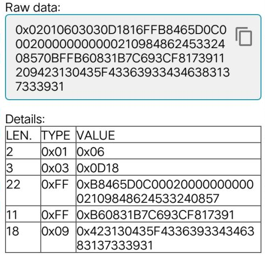

# 蓝牙终端常规广播API

| 版本  |   日期   |                      备注                      |
| :---: | :------: | :--------------------------------------------: |
| 1.0.0 | 20220402 |   对该版本之前的所有版本进行整理，形成此文档   |
| 1.0.1 | 20220816 | 增加一种可扩展的广播协议，使用广播版本0x81标记 |

1. 本协议文档（PDF版本时）可能不是最新版本；

2. 本协议文档描述，蓝牙终端常规广播API ；

3. 开发者若需要硬件对接请联系销售人员,  https://www.imyfit.com ；

4. 若协议文档有更新，不再另行通知，强烈建议开发者到 https://imyfit.gitee.io 获取在线最新协议；

5. 若有疑问请到ISSUE区提出 https://gitee.com/imyfit/imyfit-issue 愿我们的付出对您的开发事半功倍。


## 1.概述

终端广播有2种类型：可连接的广播、不可连接的广播。部分终端不一定完全满足两种类型，但至少满足可连接的广播。当终端处于未连接状态时，将广播可连接的广播数据，当手环已经被连接后，将会广播不可连接的广播数据。 

- 可连接的广播：包含 UUID 、终端名称、终端类型、终端型号、终端MAC 地址和用户自定义数据（其中UUID、用户自定义数据在广播数据中；终端类型、终端型号、MAC地址在扫描响应数据中）。

- 不可连接的广播：包含 MAC 地址、用户自定义数据域（包含在广播数据中）。

蓝牙标准广播数据格式，一般采用三段式：数据长度（len）+数据类型（type）+值（value），常见的数据类型如下表，更完整的数据类型请到蓝牙联盟官网查阅相关文档。

| 数据类型（type） | 说明             |
| :--------------: | ---------------- |
|       0x01       | 广播类型标志位   |
|       0x03       | 16位服务类别UUID |
|       0x09       | 完整的本地名称   |
|       0xFF       | 自定义数据       |

## 2.自定义数据

自定义数据的**实体**位于蓝牙标准广播中数据类型为0xFF 的后面，采用包类编号PackageID+包数据Data组包，如下表所示。

| 包类编号（PackageID） | 包数据（Data）                          |
| :-------------------: | --------------------------------------- |
|         0xB6          | 设备类型+设备型号（2Bytes）             |
|         0xB7          | MAC地址（6Bytes）                       |
|         0xB8          | 自定义数据（可变长度，最大支持20Bytes） |

### 1.终端类型/型号-0xB6

| 终端名称 | 终端类型 | 终端型号 | 说明                 |
| :------: | :------: | :------: | -------------------- |
|   X3W    |   0x08   |   0x26   |                      |
|    X3    |   0x08   |   0x23   |                      |
|    X6    |   0x08   |   0x27   |                      |
|   B10    |   0x08   |   0x20   |                      |
|   B10C   |   0x08   |   0x31   |                      |
|    R9    |   0x04   |   0xA1   |                      |
|   R9B    |   0x04   |   0xA3   |                      |
|   R9C    |   0x04   |   0xA4   |                      |
|    R8    |   0x04   |   0x72   |                      |
|    X1    |   0x04   |   0xC0   |                      |
|   I-X    |   0x04   |   0xA5   |                      |
|   M05    |   0x04   |   0x38   | 臂带                 |
|    M1    |   0x10   |   0xB1   |                      |
|    M2    |   0x10   |   0xB2   |                      |
|   I-09   |   0x10   |   0x40   |                      |
|   I-11   |   0x10   |   0x48   |                      |
|   I-01   |   0x20   |   0x06   | 工卡                 |
|   Z00    |   0x40   |   0x08   | 锚点                 |
|   Z-0X   |   0x40   |   0x00   | 网关蓝牙主机         |
|   Z01    |   0x40   |   0x10   | USB蓝牙主机，扫描M05 |
|   Z11    |   0x40   |   0x18   | 地锚（锚点）         |
|   Z12    |   0x40   |   0x20   | 墙锚（锚点）         |

### 2.状态与体征-0xB8

#### 1.终端B10/B10C 

| 字节顺序  |     内容     | 说明                                               |
| :-------: | :----------: | -------------------------------------------------- |
|     1     |    心率值    |                                                    |
|    2-4    |  步数低字节  | 低字节在前                                         |
| 5 \| bit7 |   运动模式   | 1开启 0关闭                                        |
| 5 \| bit6 |   动静状态   | 1运动 0静止                                        |
| 5 \| bit5 |     保留     |                                                    |
| 5 \| bit4 |     保留     |                                                    |
| 5 \| bit3 |     保留     |                                                    |
| 5 \| bit2 |   跌倒告警   | 1开启（持续1分钟关闭）0关闭                        |
| 5 \| bit1 |   佩戴标志   | 1佩戴 0未佩戴                                      |
| 5 \| bit0 |   SOS呼救    | 1开启（持续1分钟关闭）0关闭                        |
|     6     |   睡眠状态   |                                                    |
|     7     |  血压舒张压  |                                                    |
|     8     |  血压收缩压  |                                                    |
|     9     |     血氧     |                                                    |
|    10     |     HRV      |                                                    |
|    11     |   广播版本   |                                                    |
|   12-15   |   UTC时间    | 低字节在前                                         |
|    16     |   静息心率   |                                                    |
|    17     |   电池电量   |                                                    |
|    18     | 温度整数部分 | 佩戴时未体温数据，未佩戴时为环境温度  保留两位小数 |
|    19     | 温度小数部分 |                                                    |
|    20     |  异或校验值  | 0xB8 至字节 18 的异或校验值                        |

#### 2.终端X3W/X6/X1/R9C

| 字节顺序 |       内容       | 说明                                                         |
| :------: | :--------------: | ------------------------------------------------------------ |
|    1     |      心率值      |                                                              |
|   2-4    |    步数低字节    | 低字节在前                                                   |
| 5\|bit7  |     运动模式     | 1 开启 0关闭                                                 |
| 5\|bit6  |     动静状态     | 1运动 0静止                                                  |
| 5\|bit5  |     佩戴状态     | 1佩戴 0脱腕                                                  |
| 5\|bit4  |     SOS状态      | 1报警 0正常                                                  |
| 5\|bit3  |     充电状态     | 1充电中 0未充电                                              |
| 5\|bit2  |  充电器插入状态  | 1充电器插入 0充电器未插入                                    |
| 5\|bit1  |       保留       |                                                              |
| 5\|bit0  |       保留       |                                                              |
|    6     |     睡眠状态     | 0x00：清醒；0x01：浅度睡眠<br />0x02：深度睡眠；0xFF：未检测 |
|    7     | 环境温度低字节BB | 温度转换算法：<br />z人体温度、y体表温度、x环境温度（均为浮点型数值）<br />y = 0xCCDD * 0.005;  x = 0xAABB * 0.005;  <br />z = 0.0337yy-0.545y+1.7088x-0.0519xy+17.626 |
|    8     | 环境温度高字节AA | 同上（7）                                                    |
|    9     | 体表温度低字节DD | 同上（7）                                                    |
|    10    | 体表温度高字节CC | 同上（7）                                                    |
|    11    |     广播版本     |                                                              |
|  12-15   |     UTC时间      | 低字节在前                                                   |
|    16    |       血氧       |                                                              |
|    17    |    血压舒张压    |                                                              |
|    18    |    血压收缩压    |                                                              |
|    19    |     电池电量     |                                                              |
|    20    |    异或校验值    | 0xB8 至字节 18 的异或校验值                                  |

#### 3.终端M05

| 字节顺序 |                             内容                             | 说明                         |
| :------: | :----------------------------------------------------------: | ---------------------------- |
|    1     |                            心率值                            |                              |
| 2\|bit7  |                             模式                             | 1：自动模式<br />0：手动模式 |
| 2\|bit6  |                             保留                             |                              |
| 2\|bit5  |                             保留                             |                              |
| 2\|bit4  | 当运动模式为 1 或者 6时有效：  0：没有运动 1：行走 2：跑步3：冲刺（高加速） | 与第二行合并                 |
| 2\|bit3  |                         同上（bit4）                         | 与第二行合并                 |
| 2\|bit2  | 运动模式：   1：跑步 2：低心率模式 3：自行车 4：举重运动 5：有氧运动  6：正常运动（平常使用） | 与第二行合并                 |
| 2\|bit1  |                         同上（bit2）                         | 与第二行合并                 |
| 2\|bit0  |                         同上（bit2）                         | 与第二行合并                 |
|   3-4    |                             步数                             | 低字节在前                   |
|   5-6    |                             里程                             | 低字节在前                   |
|   7-8    |                             速度                             | 低字节在前                   |
|   9-10   |                          最大耗氧量                          | 低字节在前                   |
|    11    |                           广播版本                           |                              |
|  12-13   |                            总热量                            | 低字节在前                   |
|  14-15   |                被地毯唤醒至发出广播的时间字节                | 低字节在前                   |
|  16-17   |                     接收到的地毯ID高字节                     | 低字节在前                   |
| 18\|bit7 |                            信号值                            | 0-100%                       |
|  \|...   |                            信号值                            | 0-100%                       |
| 18\|bit1 |                            信号值                            | 0-100%                       |
| 18\|bit0 |                           信号质量                           | 0：信号良好 <br />1：信号差  |
|    19    |                           电池电量                           |                              |
|    20    |                          异或校验值                          | 0xB8 至字节 18 的异或校验值  |

#### 4.终端R8

| 字节顺序 |    内容    | 说明                                         |
| :------: | :--------: | -------------------------------------------- |
|    1     |   心率值   |                                              |
|    2     | 血压收缩压 | 预留 默认0x00                                |
|    3     | 血压舒张压 | 预留 默认0x00                                |
|    4     |    晃动    | 0x00：表示静止；0x01：表示晃动中；其他：无效 |
|    5     |    电量    | （单位：百分比%）                            |
| 6\|bit7  |    保留    | 1：自动模式；0：手动模式                     |
| 6\|bit6  |    保留    |                                              |
| 6\|bit5  |    保留    |                                              |
| 6\|bit4  |    保留    |                                              |
| 6\|bit3  |    保留    |                                              |
| 6\|bit2  |  SOS 报警  | 0：正常；1：报警                             |
| 6\|bit1  |    呼叫    | 0：正常；1：报警                             |
| 6\|bit0  |    防拆    | 0：正常；1：报警                             |
|   7-9    |    步数    | 低字节在前                                   |
|  10-19   |    预留    | 0x00                                         |
|    20    | 异或校验值 | 0xB8 至字节 19 的异或校验值                  |

#### 5.终端R9

| 字节顺序 |       内容       | 说明          |
| :------: | :--------------: | ------------- |
|    1     |      心率值      |               |
|   2-4    |       步数       | 低字节在前    |
|    5     |     拆带与否     | 0已拆，1未拆  |
|    6     |     动静状态     | 0动，1静      |
|    7     |     血氧浓度     | 单位：百分比% |
|    8     | 环境温度整数部分 | 单位：摄氏度  |
|    9     | 环境温度小数部分 | 单位：摄氏度  |
|    10    | 体表温度整数部分 | 单位：摄氏度  |
|    11    | 体表温度小数部分 | 单位：摄氏度  |
|    12    |      收缩压      | 单位：mmHg    |
|    13    |      舒张压      | 单位：mmHg    |
|    14    |    睡眠总时间    | 单位：10min   |
|    15    |     深睡时间     | 单位：10min   |
|    16    |     浅睡时间     | 单位：10min   |
|    17    |     电池电量     | 单位：百分比% |
|    18    |    异或校验值    | 尚未启用      |

#### 6.网关Z-0X

| 字节顺序 |    内容    | 说明                                                     |
| :------: | :--------: | -------------------------------------------------------- |
|   1-4    |  UTC时间   | 低字节在前                                               |
|    5     |    事件    | 0x00：无  0x01：一级警报  0x02：二级警报  0x03：三级警报 |
|   6-15   |   预留值   |                                                          |
|    16    | 异或校验值 | 0xB8 至字节 15 的异或校验值                              |

#### 7.锚点Z00

| 字节顺序 |               内容                | 说明                        |
| :------: | :-------------------------------: | --------------------------- |
|    1     |       扫描到的设备1信号强度       |                             |
|   2-7    | 扫描到的设备1 MAC地址，低字节在前 | 低字节在前                  |
|    8     |       扫描到的设备2信号强度       |                             |
|   9-14   | 扫描到的设备2 MAC地址，低字节在前 | 低字节在前                  |
|    15    |          电池电量百分比           |                             |
|    16    |            异或校验值             | 0xB8 至字节 15 的异或校验值 |

#### 8.标签I-01

| 字节顺序 |      内容      | 说明                       |
| :------: | :------------: | -------------------------- |
|    1     |  广播发射功率  | 固定0，0dB。               |
|    2     | 电池电量百分比 |                            |
|    3     |   异或校验值   | 0xB8 至字节 2 的异或校验值 |

#### 9.终端统一广播数据格式【广播版本为0x81】【X3\X6\X1\B10C\R9C】

| 字节顺序  |      内容      | 说明                                                         |
| :-------: | :------------: | ------------------------------------------------------------ |
|     1     |     心率值     |                                                              |
| 2 \| bit7 |    运动模式    | 1开启 0关闭                                                  |
| 2 \| bit6 |    动静状态    | 1运动 0静止                                                  |
| 2 \| bit5 |    充电状态    | 1充电中 0未充电                                              |
| 2 \| bit4 | 充电器插入状态 | 1充电器插入 0充电器未插入                                    |
| 2 \| bit3 |      保留      |                                                              |
| 2 \| bit2 |    跌倒告警    | 1开启（持续1分钟关闭）0关闭                                  |
| 2 \| bit1 |    佩戴标志    | 1佩戴 0未佩戴                                                |
| 2 \| bit0 |    SOS呼救     | 1开启（持续1分钟关闭）0关闭                                  |
|     3     |    睡眠状态    | 0x00：清醒；0x01：浅度睡眠<br />0x02：深度睡眠；0xFF：未检测 |
|    4-7    |      UTC       | 低字节在前                                                   |
|    8-9    |      RRI       | 低字节在前                                                   |
|    10     |      空闲      |                                                              |
|    11     |    广播版本    | 【终端设备做成可配置】最高位表示广播类型<br />1表示新的特殊广播<br />0表示之前的设备广播<br />使用此协议配置为0x81<br />使用AOA广播配置为0x80 |
|   12-18   |  可变数据部分  | 一共7个字节，第一个字节为自定义标记                          |
|    19     |    电池电量    |                                                              |
|    20     |   异或校验值   | 0xB8 至字节 18 的异或校验值                                  |

可变数据部分[每四包更新一次]：

| 自定义标记 | 说明     |        字节1        | 字节2              | 字节3              | 字节4            | 字节5      | 字节6      |
| :--------: | -------- | :-----------------: | ------------------ | ------------------ | ---------------- | ---------- | ---------- |
|     00     | 计步     |     计步低字节      | 计步中字节         | 计步高字节         | 热量低字节       | 热量中字节 | 热量高字节 |
|     01     | 计步     |     里程低字节      | 里程中字节         | 里程高字节         | 空闲             | 空闲       | 空闲       |
|     02     | 体温     |  环境温度低字节BB   | 环境温度高字节AA   | 体表温度低字节DD   | 体表温度高字节CC | 空闲       | 空闲       |
|     03     | 睡眠时间 | 参考：sleep数据说明 |                    |                    |                  |            |            |
|     04     | 血压血氧 |        血氧         | 收缩压             | 舒张压             | 静息心率         | 空闲       | 空闲       |
|     05     | HRV-SDNN |  参考：HRV数据说明  |                    |                    |                  |            |            |
|     06     | HRV-VLF  |  参考：HRV数据说明  |                    |                    |                  |            |            |
|     07     | HRV-LF   |  参考：HRV数据说明  |                    |                    |                  |            |            |
|     08     | HRV-HF   |  参考：HRV数据说明  |                    |                    |                  |            |            |
|     09     | HRV-TP   |  参考：HRV数据说明  |                    |                    |                  |            |            |
|     0A     | 气压     | 气压整数部分低字节  | 气压整数部分中字节 | 气压整数部分高字节 | 气压小数部分     |            |            |

```
HRV数据说明:
5B SDNN {float sdnn = (int)[1,4] + ((int)[5])/255.0;}
5B TP   {float tp   = (int)[1,4] + ((int)[5])/255.0;}
5B LF   {float lf   = (int)[1,4] + ((int)[5])/255.0;}
5B HF   {float hf   = (int)[1,4] + ((int)[5])/255.0;}
5B VLF  {float vlf  = (int)[1,4] + ((int)[5])/255.0;}
```

```
Sleep数据说明:
总睡眠时间 = bit[1] << 4 | bit[2] >> 4
深睡时间 = (bit[2] & 0x0f) << 8  | bit[3]
浅睡时间 = bit[4] << 4 | bit[5] >> 4
快速眼动时间 = (bit[5] & 0x0f) << 8  | bit[6]
```

```
HRV数据说明:
5B SDNN {float sdnn = (int)[1,4] + ((int)[5])/255.0;}
5B TP   {float tp   = (int)[1,4] + ((int)[5])/255.0;}
5B LF   {float lf   = (int)[1,4] + ((int)[5])/255.0;}
5B HF   {float hf   = (int)[1,4] + ((int)[5])/255.0;}
5B VLF  {float vlf  = (int)[1,4] + ((int)[5])/255.0;}
```

```
温度转换算法：
z人体温度、y体表温度、x环境温度（均为浮点型数值）
y = 0xCCDD * 0.005;  x = 0xAABB * 0.005;  
z = 0.0337yy-0.545y+1.7088x-0.0519xy+17.626
```

## 3.附录-解析示例

如下图是使用nRF_Connect得到的B10C可连接广播数据。



终端类型/型号：0xB6。终端类型：0x08；终端型号：0x31，查找终端类型/型号表此终端为B10C。

终端MAC地址：0xB7。地址：C693CF817391

状态与体征：0xB8。465D0C000200 0000 00 00 0210984862 4533240857，解析如下：

| 字节顺序 | 内容（HEX） | 说明                                        |
| :------: | :---------: | ------------------------------------------- |
|    1     |     46      | 心率0x46 --> 70                             |
|   2-4    |   5D0C00    | 计步0x0C5D --> 3165                         |
| 5\|bit7  |      0      | 运动模式 ： 关闭                            |
| 5\|bit6  |      0      | 动静状态 ： 静止                            |
| 5\|bit5  |      0      |                                             |
| 5\|bit4  |      0      |                                             |
| 5\|bit3  |      0      |                                             |
| 5\|bit2  |      0      | 跌倒告警： 关闭                             |
| 5\|bit1  |      1      | 佩戴标志： 佩戴                             |
| 5\|bit0  |      0      | SOS呼救： 关闭                              |
|    6     |     00      | 睡眠状态： 清醒                             |
|    7     |     00      | 血压舒张压：未测量                          |
|    8     |     00      | 血压收缩压：未测量                          |
|    9     |     00      | 血氧：未测量                                |
|    10    |     00      | HRV：未测量                                 |
|    11    |     02      | 版本：0x02                                  |
|  12-15   |  10984862   | UTC时间：0x62489810 --> 2022-04-02 18:38:08 |
|    16    |     45      | 静息心率：0x45 --> 69                       |
|    17    |     33      | 电池电量：0x33 --> 51                       |
|    18    |     24      | 温度整数部分：0x24 --> 36                   |
|    19    |     08      | 温度小数部分：0x08 --> 08 温度：36.08       |
|    20    |     57      | 字节1 至字节 19  的异或校验值               |

## <<[返回](./README.md) 
